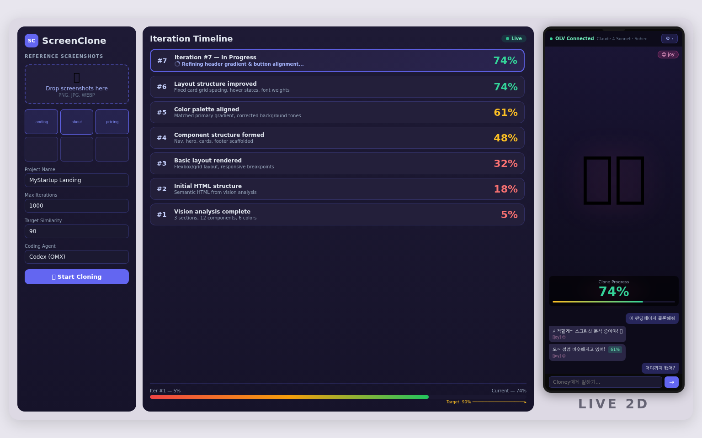
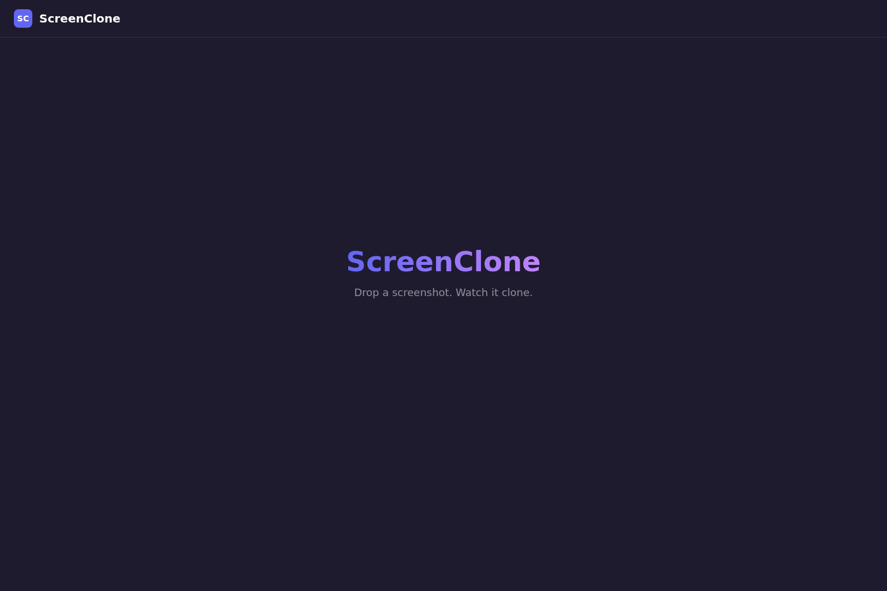
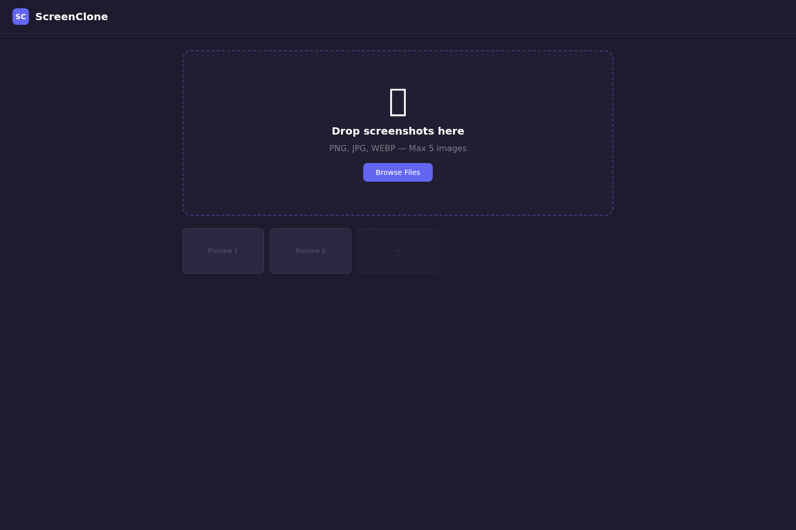
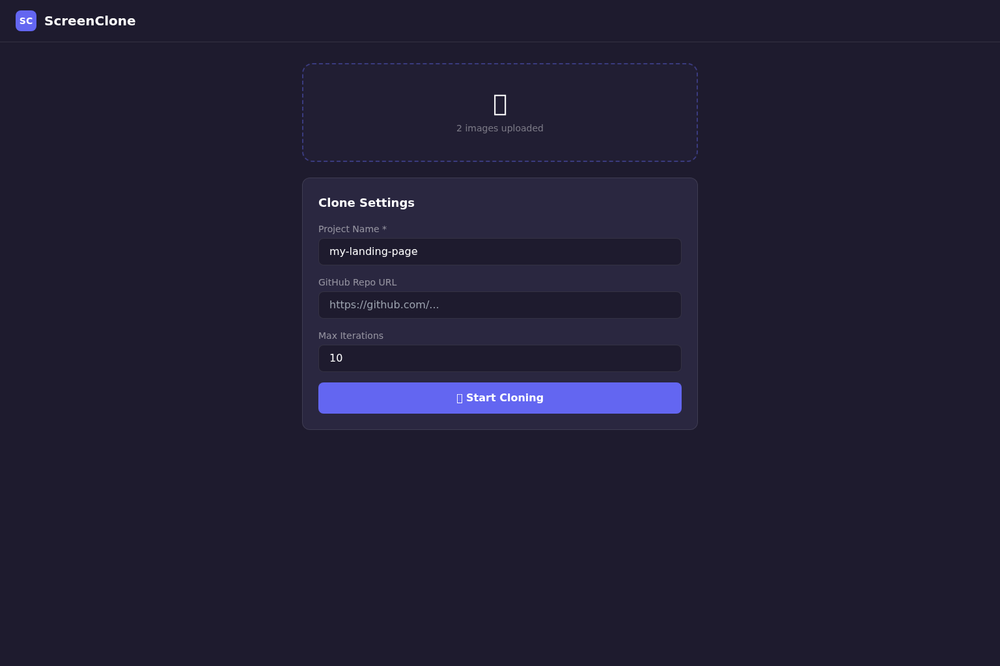
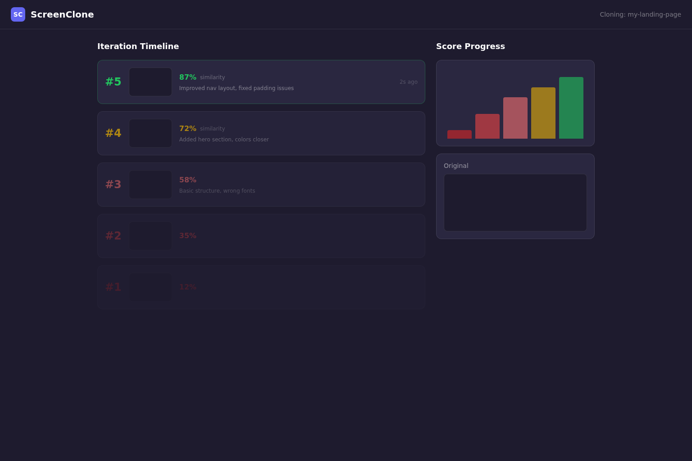
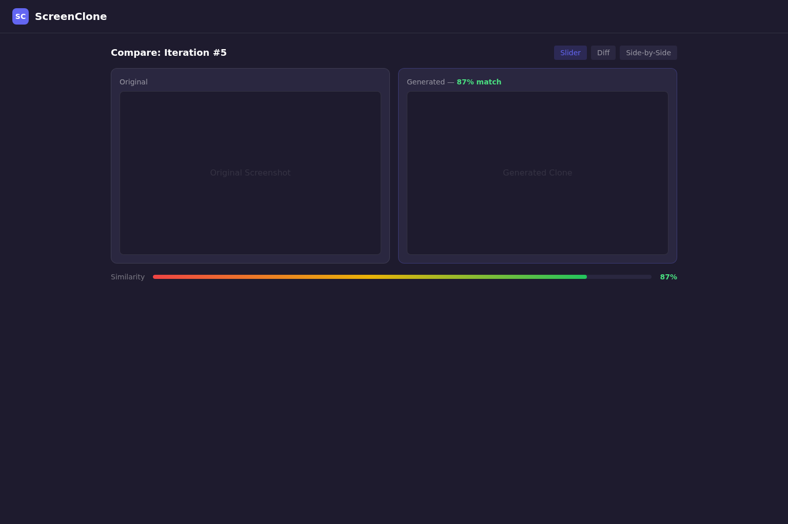
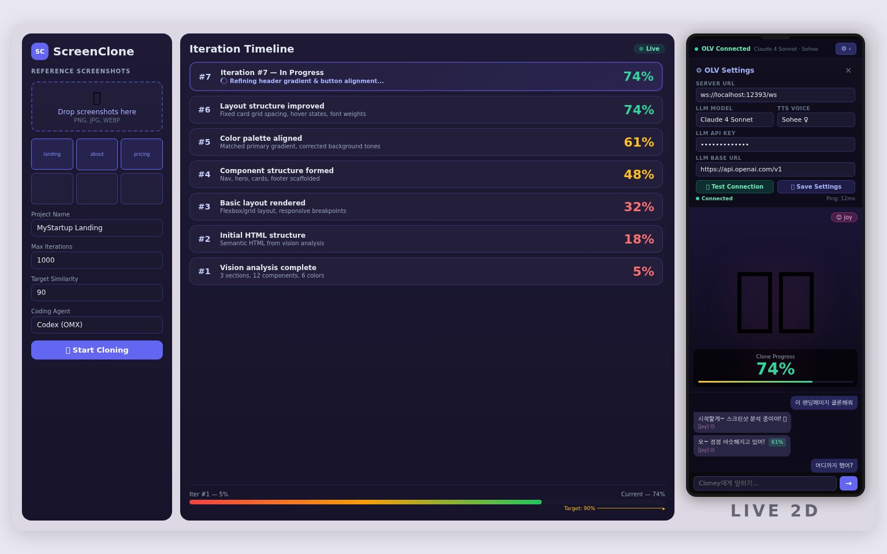

# RalphTon (ScreenClone) — Product Requirements Document

> RalphTon is a web application where users interact with Cloney — a Live2D character powered by OpenWaifu (Open-LLM-VTuber) — to clone websites from screenshots. The user drops a screenshot and chats with Cloney, who orchestrates ralph-image-analysis (ralph.sh --tool omx) as the backend engine. Ralph iteratively generates HTML/CSS/JS, renders via Puppeteer, and evaluates using a dual comparison system: (1) Vision-based verdict via GPT-5.3 Codex image understanding for qualitative service-level similarity scoring + specific actionable feedback, and (2) pixelmatch for quantitative pixel-diff visualization. The Vision verdict is the primary feedback signal driving the ralph loop — it provides structured differences and suggestions that feed directly into the next iteration's prompt. Loop continues until Vision verdict score exceeds 90%. Cloney reports progress conversationally with emotion-driven TTS (Qwen3) and Live2D expressions (WaifuClaw 16 expressions). Each improving iteration auto-commits to GitHub.

**Branch:** `feature/screenclone`

**Total User Stories:** 21

## Full Layout Reference

Left sidebar (upload + settings) → Center (iteration timeline) → Right (Live2D + OLV settings + chat)

---

## US-001: Vite + React + TypeScript + TailwindCSS project scaffold

Initialize the monorepo structure with a Vite-powered React 18 frontend and a separate Express backend directory. Frontend uses TypeScript strict mode and TailwindCSS with dark mode as default. Backend uses TypeScript with ts-node. Shared types in a common directory.

### UI Reference

### Acceptance Criteria

- [ ] npm run dev starts frontend at localhost:5173 without errors
- [ ] npm run server starts Express backend at localhost:3001 without errors
- [ ] Page renders 'RalphTon' heading with gradient text on dark background (#1e1b2e)
- [ ] TailwindCSS dark mode classes apply correctly (class strategy)
- [ ] TypeScript strict mode enabled, tsc --noEmit passes for both frontend and backend
- [ ] Directory structure: src/client/, src/server/, src/shared/types/
- [ ] package.json has scripts: dev (frontend), server (backend), dev:all (concurrently)
- [ ] ESLint + Prettier configured with consistent rules
- [ ] CORS configured on Express to allow localhost:5173

**Notes:** Use concurrently for dev:all script. TailwindCSS config: darkMode 'class', custom colors: primary #6366f1, surface #1e1b2e, card #2a2740.

---

## US-002: Drag-and-drop screenshot upload with preview thumbnails

Full-featured drop zone component that accepts PNG/JPG/WEBP screenshots via drag-and-drop or click-to-browse. Shows thumbnail previews with remove buttons. Validates file type and size. Stores files in component state and prepares FormData for upload.

### UI Reference

### Acceptance Criteria

- [ ] Drop zone visible on main page with dashed border, icon, and 'Drop screenshots here' text
- [ ] Accepts drag-and-drop: dragenter highlights border (primary color), dragleave reverts
- [ ] Click-to-browse opens file picker with accept='image/png,image/jpeg,image/webp'
- [ ] Rejects non-image files with toast error message
- [ ] Max file size 10MB per image, shows error for oversized files
- [ ] Max 5 images enforced — drop zone shows '5/5' counter and disables further uploads
- [ ] Thumbnail grid renders below drop zone (5 columns) with aspect-ratio preserved
- [ ] Each thumbnail has X button in top-right corner to remove
- [ ] Removing an image updates counter and re-enables drop zone if was at max
- [ ] Files stored as File objects in React state (not uploaded yet)
- [ ] Empty state shows subtle placeholder boxes
- [ ] Typecheck passes

**Notes:** Use react-dropzone or native drag events. Object URLs for previews — revoke on remove/unmount to prevent memory leaks.

---

## US-003: Clone session configuration form with validation

Form below the upload zone with project name, GitHub repo URL, GitHub token, max iterations, and target similarity score. Validates required fields. Saves last-used settings to localStorage. Start button triggers the clone session.

### UI Reference

### Acceptance Criteria

- [ ] Form renders in a card below upload zone with consistent dark theme styling
- [ ] Fields: project name (text, required), GitHub repo URL (text, optional), GitHub token (password, optional), max iterations (number, default 1000, min 1), target similarity (number, default 90, range 50-100)
- [ ] Start button disabled until: project name filled AND at least 1 image uploaded
- [ ] Start button shows '🚀 Start Cloning' with primary color background
- [ ] On submit: saves all field values to localStorage keyed by 'ralphton-config'
- [ ] On mount: loads saved values from localStorage and pre-fills form
- [ ] GitHub token field has show/hide toggle icon
- [ ] Validation errors shown inline below each field in red text
- [ ] When clone is running, form is disabled with opacity reduction
- [ ] Typecheck passes

**Notes:** Use react-hook-form or simple controlled components. localStorage key: 'ralphton-config'.

---

## US-004: Express backend with multipart image upload API

Express server with multer middleware for image uploads. POST /api/upload accepts up to 5 images, validates MIME type, stores in session-specific temp directory, returns file paths and metadata. Includes health check and CORS.

### Acceptance Criteria

- [ ] GET /api/health returns { status: 'ok', version: '1.0.0' }
- [ ] POST /api/upload accepts multipart/form-data with field name 'screenshots'
- [ ] Multer configured: max 5 files, max 10MB each, filter for image/png, image/jpeg, image/webp only
- [ ] Files stored in /tmp/ralphton-{sessionId}/ with original filenames
- [ ] Returns JSON: { sessionId: string, files: Array<{ filename, path, size, mimetype }> }
- [ ] Session ID is UUID v4, generated per upload request
- [ ] Rejects non-image files with 400 and descriptive error message
- [ ] Rejects requests with no files with 400
- [ ] Rejects requests exceeding 5 files with 400
- [ ] Temp directories cleaned up after 24 hours via setInterval cleanup
- [ ] Express error handler returns consistent JSON error format: { error: string, code: string }
- [ ] Typecheck passes

**Notes:** Use multer with diskStorage. uuid package for session IDs. Cleanup interval: check /tmp/ralphton-* directories older than 24h.

---

## US-005: Vision API screenshot analyzer endpoint

POST /api/analyze sends uploaded screenshots to a vision-capable LLM (OpenAI GPT-4V or Claude 3.5) to extract structured UI description. Returns layout structure, color palette, component inventory, text content, and responsive breakpoints.

### Acceptance Criteria

- [ ] POST /api/analyze accepts { sessionId: string, imageIndex?: number }
- [ ] Reads images from session temp directory
- [ ] Sends images as base64 to vision LLM with structured extraction prompt
- [ ] Returns JSON: { layout: { type, direction, sections[] }, colorPalette: { primary, secondary, background, text, accent }, components: Array<{ type, position, props }>, textContent: string[], fonts: string[], responsiveHints: string[] }
- [ ] Supports OPENAI_API_KEY env var for GPT-4V, ANTHROPIC_API_KEY for Claude
- [ ] Falls back to Claude if OpenAI unavailable, and vice versa
- [ ] Timeout: 60 seconds per analysis request
- [ ] Caches analysis result in session state to avoid re-analyzing same images
- [ ] Returns 404 if session ID not found, 500 if LLM call fails with retry info
- [ ] Typecheck passes

**Notes:** Vision prompt should extract: DOM structure estimate, CSS grid/flex layout, exact hex colors, font families, component types (nav, hero, card, footer, etc).

---

## US-006: Ralph loop process manager — spawn and manage ralph.sh

Core backend service that spawns ralph.sh from ralph-image-analysis as a child process per clone session. Manages process lifecycle, captures stdout/stderr in ring buffer, watches progress.txt for changes, and emits structured events. Each session gets its own isolated ralph.sh process with --tool omx and the session's uploaded images.

### Acceptance Criteria

- [ ] RalphProcessManager class with methods: start(sessionId, config), stop(sessionId), getStatus(sessionId), getOutput(sessionId, lastN)
- [ ] start() generates per-session prd.json from user config + analysis results, writes to session temp dir
- [ ] start() spawns: ralph.sh --tool omx --images-dir <session-images-dir> <maxIterations>
- [ ] Child process stdout/stderr captured in ring buffer (last 500 lines per session)
- [ ] fs.watch on progress.txt — parses new entries and emits 'iteration-complete' events
- [ ] Detects iteration number from ralph.sh stdout pattern: 'Ralph Iteration N of M'
- [ ] Detects completion from '<promise>COMPLETE</promise>' in stdout
- [ ] Detects failure from process exit code != 0
- [ ] Session state machine: idle → uploading → analyzing → cloning → completed | failed
- [ ] Max 3 concurrent sessions (configurable via RALPH_MAX_SESSIONS env var)
- [ ] Graceful shutdown: SIGTERM to all child processes on server stop
- [ ] getStatus returns: { state, currentIteration, maxIterations, lastScore, startedAt, elapsedMs }
- [ ] EventEmitter pattern for state changes — consumed by SSE endpoint
- [ ] Typecheck passes

**Notes:** ralph.sh lives at scripts/ralph/ralph.sh. prd.json template generated per-session with single story: 'Clone the uploaded screenshot'. child_process.spawn with {stdio: 'pipe', cwd: sessionDir}. Kill child on session abort.

---

## US-007: Puppeteer headless render and screenshot capture service

POST /api/render accepts HTML string, renders in headless Puppeteer, captures screenshot at specified viewport dimensions, returns base64 PNG. Used by the ralph loop to screenshot each iteration's generated code for visual comparison.

### Acceptance Criteria

- [ ] POST /api/render accepts { html: string, width?: number, height?: number, waitMs?: number }
- [ ] Default viewport 1536x1024 (matches reference screenshot dimensions)
- [ ] Renders HTML in isolated Puppeteer page with no external network access (--disable-web-security off)
- [ ] Waits for: DOMContentLoaded + optional waitMs (default 1000ms) for CSS transitions
- [ ] Returns { screenshot: string (base64 PNG), width: number, height: number, renderTimeMs: number }
- [ ] Puppeteer browser instance shared across requests (singleton, lazy-init)
- [ ] Each render uses a new page (closed after screenshot to prevent memory leaks)
- [ ] Timeout per render: 30 seconds, returns 504 on timeout
- [ ] Rejects HTML larger than 1MB with 413
- [ ] Injects <base> tag to prevent external resource loading
- [ ] Typecheck passes

**Notes:** Use puppeteer-core + system Chromium or puppeteer with bundled Chromium. Singleton browser pattern: let browser = null; async function getBrowser() { if (!browser) browser = await puppeteer.launch(...); return browser; }

---

## US-008: Vision-based visual verdict engine (primary) + pixelmatch diff overlay (secondary)

Dual comparison system for evaluating clone quality. PRIMARY: Vision verdict via GPT-5.3 Codex image understanding — sends original + generated screenshots to the vision model, returns structured verdict with score, categorical matches, specific differences, and actionable suggestions. This is the main feedback signal driving the ralph loop and what makes each iteration smarter. SECONDARY: pixelmatch pixel-diff for visual overlay in the UI only. The Vision verdict evaluates 'is this the same web service' rather than 'are these identical pixels'.

### Acceptance Criteria

- [ ] POST /api/compare accepts { original: string (base64), generated: string (base64), mode?: 'vision' | 'pixel' | 'both' }
- [ ] Default mode: 'both' — runs Vision verdict + pixelmatch in parallel (Promise.all)
- [ ] Vision verdict calls GPT-5.3 Codex with both images as base64 + structured JSON output prompt
- [ ] Vision verdict response schema: { score: number (0-100), layout_match: boolean, color_match: boolean, component_match: boolean, text_match: boolean, responsive_match: boolean, differences: string[] (specific issues found, max 10 items), suggestions: string[] (actionable code fixes, max 5 items), verdict: 'pass' | 'close' | 'fail', reasoning: string (1-2 sentence summary) }
- [ ] Vision prompt instructs: evaluate as 'same web service/product' not 'pixel-identical' — judge layout structure, visual hierarchy, color palette coherence, component inventory completeness, text content accuracy, overall brand feel
- [ ] score interpretation: 0-30 fail (fundamentally different), 30-60 fail (structure recognizable but major issues), 60-80 close (similar but notable differences), 80-90 close (very similar, minor polish needed), 90+ pass (production-quality clone)
- [ ] Pixelmatch runs in parallel: returns { pixelScore: number, diffImage: string (base64 PNG red overlay), mismatchedPixels: number, totalPixels: number }
- [ ] Combined response: { vision: {verdict object}, pixel: {pixelmatch object}, primaryScore: number (= vision.score) }
- [ ] primaryScore (vision.score) is the loop control signal — loop stops when >= targetScore
- [ ] differences[] and suggestions[] injected into progress.txt as structured feedback: '## Visual Verdict — Iteration N\nScore: X/100 (verdict)\n### Differences\n- diff1\n- diff2\n### Suggestions\n- fix1\n- fix2'
- [ ] This feedback is what ralph.sh reads on next iteration — the agent sees exactly what to fix
- [ ] Caches verdict per (sessionId, iteration) — avoids re-calling on status/reconnect
- [ ] Falls back to pixelmatch-only mode if Vision API fails (logs warning, uses pixel score as primaryScore)
- [ ] Rate limiting: max 1 Vision API call per 5 seconds per session
- [ ] Resizes generated image to match original dimensions before both comparisons (sharp)
- [ ] Returns 400 if images are invalid/corrupt base64
- [ ] Typecheck passes

**Notes:** This is the key innovation: ralph doesn't just know the score, it knows WHAT to fix and HOW. Vision prompt template: 'You are a senior frontend developer reviewing a website clone attempt. Image 1 is the ORIGINAL. Image 2 is the CLONE. Evaluate similarity as a web product (not pixels). Return JSON: {score, layout_match, color_match, component_match, text_match, responsive_match, differences[], suggestions[], verdict, reasoning}'. Use pixelmatch + pngjs for secondary diff image. sharp for resizing.

---

## US-009: Ralph loop orchestrator with SSE real-time streaming

POST /api/loop/start initiates a full clone session: upload → analyze → spawn ralph.sh → stream progress via Server-Sent Events. Each iteration event includes score, screenshot, code preview, and diff image. GET /api/loop/:sessionId/status for polling. GET /api/loop/:sessionId/events for SSE stream.

### Acceptance Criteria

- [ ] POST /api/loop/start accepts { sessionId: string, config: { projectName, maxIterations, targetScore, githubUrl?, githubToken? } }
- [ ] Validates sessionId exists and has uploaded images
- [ ] Calls /api/analyze internally, then starts RalphProcessManager
- [ ] GET /api/loop/:sessionId/events returns SSE stream (Content-Type: text/event-stream)
- [ ] SSE events emitted: iteration-start, iteration-complete, loop-complete, loop-error
- [ ] iteration-complete event data: { iteration, maxIterations, score, previousScore, improvement, screenshotBase64, codePreview (first 200 chars), diffImageBase64, commitUrl?, elapsedMs }
- [ ] loop-complete event data: { totalIterations, finalScore, totalElapsedMs, bestIteration }
- [ ] loop-error event data: { error, iteration, lastScore }
- [ ] SSE keepalive: sends comment every 15 seconds to prevent timeout
- [ ] GET /api/loop/:sessionId/status returns full session state (for reconnection/polling)
- [ ] POST /api/loop/:sessionId/stop sends SIGTERM to ralph.sh process
- [ ] Handles client disconnect: keeps ralph running but stops SSE stream
- [ ] Multiple clients can subscribe to same session's SSE stream
- [ ] Typecheck passes

**Notes:** SSE format: 'event: iteration-complete\ndata: {json}\n\n'. Use EventEmitter from RalphProcessManager. res.write() for SSE, res.flush() if compression enabled. Set headers: Cache-Control no-cache, Connection keep-alive.

---

## US-010: Real-time iteration timeline UI with live updates

Main frontend view showing iteration progress as a vertical timeline of cards. Cards appear in real-time as SSE events arrive. Each card shows iteration number, thumbnail screenshot, similarity score with color coding, improvement delta, and feedback text. Clicking a card expands to show full screenshot + code.

### UI Reference

### Acceptance Criteria

- [ ] Timeline renders as vertical list, newest iteration at top
- [ ] Cards appear with slide-in animation as SSE events arrive (useEventSource hook)
- [ ] Each card shows: iteration # (large bold), thumbnail (120x80px), score (color: red <50, yellow 50-80, green >80), improvement delta (+/- from previous), feedback snippet (truncated to 1 line)
- [ ] Score color coding: text-red-400 for <50%, text-yellow-400 for 50-80%, text-green-400 for >80%
- [ ] Clicking card expands inline to show: full-size screenshot, code preview (syntax highlighted), diff image overlay, commit link if available
- [ ] Active/running iteration shows pulsing border animation
- [ ] Completed loop shows confetti/success banner at top
- [ ] Failed loop shows error banner with retry button
- [ ] Auto-scrolls to newest card unless user has scrolled up (intersection observer)
- [ ] Empty state: 'Waiting for first iteration...' with spinner
- [ ] Handles SSE reconnection automatically on disconnect (retry after 3s)
- [ ] Typecheck passes

**Notes:** Custom useEventSource hook wrapping EventSource API. Use framer-motion or CSS animations for card entrance. Intersection Observer for auto-scroll control.

---

## US-011: Side-by-side original vs clone comparison view with slider

Split comparison view: original screenshot (left) vs latest generated output (right). Interactive slider overlay that blends between the two. Toggle for pixel-diff red overlay mode. Similarity score bar between images.

### UI Reference

### Acceptance Criteria

- [ ] Split view layout: 50/50 grid with original (left) and generated (right)
- [ ] Both images rendered at equal size, maintaining aspect ratio
- [ ] Interactive slider: draggable vertical divider that reveals original/generated (CSS clip-path)
- [ ] Slider position shown as percentage label
- [ ] Three view modes via toggle buttons: Side-by-Side, Slider, Diff Overlay
- [ ] Diff Overlay mode: shows diff image (red pixels on transparent) overlaid on original
- [ ] Similarity score bar between images: gradient from red to green, filled to score %
- [ ] Score displayed numerically next to bar with decimal precision (e.g., 87.3%)
- [ ] Dropdown to select which iteration to compare (defaults to latest)
- [ ] Zoom: scroll wheel zooms both images synchronously
- [ ] Pan: click-drag pans both images synchronously when zoomed
- [ ] Keyboard: left/right arrow to switch iterations, space to toggle overlay
- [ ] Typecheck passes

**Notes:** Slider: use CSS clip-path: inset(0 {100-sliderPos}% 0 0) on overlay image. Synchronized zoom/pan via shared transform state.

---

## US-012: Live similarity score line chart

Recharts line chart showing similarity score progression over iterations. Updates in real-time as new iterations complete. Shows target threshold line, best score marker, and trend indicator.

### Acceptance Criteria

- [ ] Line chart with X-axis = iteration number, Y-axis = similarity score (0-100%)
- [ ] Data points update live as SSE iteration-complete events arrive
- [ ] Horizontal dashed line at target score (default 90%) labeled 'Target'
- [ ] Line color changes: red segment <50%, yellow 50-80%, green >80%
- [ ] Best score point highlighted with larger dot + label
- [ ] Tooltip on hover: shows iteration #, score, improvement, elapsed time
- [ ] Y-axis always 0-100, X-axis auto-scales with iterations
- [ ] Chart height: 200px in sidebar, expandable to 400px on click
- [ ] Shows 'No data' placeholder before first iteration
- [ ] Smooth animation on new data point (animationDuration 300ms)
- [ ] Typecheck passes

**Notes:** Use recharts: LineChart, Line, XAxis, YAxis, Tooltip, ReferenceLine for target. CartesianGrid with strokeDasharray for subtle grid.

---

## US-013: GitHub auto-commit per improving iteration

When GitHub repo URL and token are configured, each iteration that improves the best score auto-commits the generated code to a dedicated branch. Commit message includes iteration number and score. Commit URL returned in SSE events.

### Acceptance Criteria

- [ ] Creates branch 'ralph/clone-{projectName}-{timestamp}' on first improving iteration
- [ ] Commits generated HTML/CSS/JS files with message: 'ralph(#{iteration}): score {score}% (+{delta}%)'
- [ ] Only commits when current score > previous best score (no regression commits)
- [ ] Commit includes: index.html, styles.css, script.js, and README.md with score history
- [ ] README.md auto-generated with: project name, original screenshot (as reference), iteration log table
- [ ] Commit URL included in SSE iteration-complete event: commitUrl field
- [ ] Uses GitHub REST API via octokit — creates tree + commit (not push, to handle fast-forward)
- [ ] On final iteration: creates summary commit with '[final]' prefix
- [ ] Handles GitHub API errors gracefully: logs warning, continues loop without blocking
- [ ] GitHub token validated on session start (GET /user), returns 401 if invalid
- [ ] Typecheck passes

**Notes:** Use @octokit/rest. createOrUpdateFileContents API for simplicity. Branch from default branch HEAD.

---

## US-014: Download final result as ZIP archive

Button to download the final generated website as a production-ready ZIP file. Includes all generated code, assets, README with build history, and original screenshots for reference.

### Acceptance Criteria

- [ ] Download button appears in header bar when loop completes (state: completed)
- [ ] Button text: '📦 Download ZIP' with file size estimate
- [ ] GET /api/loop/:sessionId/download returns application/zip
- [ ] ZIP contains: index.html (final generated), styles.css, script.js, README.md
- [ ] README.md includes: project name, final score, total iterations, original screenshot as embedded base64, score history table, timestamp
- [ ] ZIP also includes originals/ directory with uploaded reference screenshots
- [ ] ZIP also includes iterations/ directory with best 3 iteration screenshots
- [ ] ZIP file named: ralphton-{projectName}-{score}pct.zip
- [ ] Backend generates ZIP in memory using archiver or jszip
- [ ] Returns 404 if session not found, 409 if loop still running
- [ ] Typecheck passes

**Notes:** Use archiver package for streaming ZIP creation. Pipe directly to response for memory efficiency.

---

## US-015: OpenWaifu WebSocket bridge — embed Live2D Cloney + OLV settings panel in frontend

Integrate OpenWaifu's WebSocket client into the React frontend. Right-side panel contains: (1) OLV Settings section at top — server URL, LLM model selection, API key, TTS voice, persona toggle, connection test button. (2) Live2D canvas rendering WaifuClaw model in the middle. (3) Chat history with conversation bubbles. (4) Text input at bottom. Panel connects to OpenWaifu/OLV server via WebSocket.

### UI Reference

**Collapsed (default):**

**Settings drawer open:**

### Acceptance Criteria

- [ ] Right-side panel (30% width) with 4 sections: OLV Settings (top), Live2D canvas, chat history, text input
- [ ] OLV Settings section (collapsible with toggle):
- [ ]   - Server URL input (default ws://localhost:12393/ws, configurable)
- [ ]   - LLM Model dropdown (OpenAI GPT-4o, Claude 4 Sonnet, Gemini 3 Pro, Ollama local, custom)
- [ ]   - LLM API Key input (password field with show/hide toggle)
- [ ]   - LLM Base URL input (for custom endpoints)
- [ ]   - TTS Voice selector (Sohee default, with preview button)
- [ ]   - Persona toggle (enable/disable custom persona prompt)
- [ ]   - Connection test button — pings OLV WebSocket, shows green/red status
- [ ]   - Save Settings button — persists to localStorage
- [ ]   - Settings auto-loaded from localStorage on mount
- [ ] Live2D canvas renders WaifuClaw model via pixi-live2d-display or OpenWaifu's built-in renderer
- [ ] WebSocket connects using configured server URL from settings
- [ ] Handles WebSocket message types: text-input (send), audio-play-start (receive), display_text (receive), set-expression (receive)
- [ ] Chat history shows conversation bubbles: user (right, primary) and Cloney (left, card color)
- [ ] Cloney messages include emotion tags: [joy]→😊, [sadness]→😢, [surprise]→😲, [neutral]→😐
- [ ] Connection status indicator: green (connected), yellow (connecting), red (disconnected)
- [ ] Auto-reconnect on disconnect with exponential backoff (1s→30s max)
- [ ] Panel collapsible via toggle button (saves state to localStorage)
- [ ] When collapsed: floating Cloney avatar (64x64) in bottom-right with unread badge
- [ ] Typecheck passes

**Notes:** OLV settings map to conf.yaml fields: openai_compatible_llm.base_url, openai_compatible_llm.llm_api_key, openai_compatible_llm.model, qwen3_tts.voice. Settings saved to localStorage key: "ralphton-olv-config". On save, optionally POST to OLV /api/config to hot-reload without restart. Connection test: WebSocket open + close within 3s = success.

---

## US-016: Cloney conversation → ScreenClone action bridge

Bridge layer that intercepts Cloney's conversation context and maps user intents to ScreenClone backend actions. When user tells Cloney to clone something, Cloney triggers the ralph loop. When screenshots are shared in chat, they're added to the session. Cloney's LLM persona is extended with tool-use instructions for ScreenClone operations.

### Acceptance Criteria

- [ ] Intent detection: user messages containing 'clone', '클론', 'copy', '복사', 'make this', '만들어' trigger clone flow
- [ ] When clone intent detected + images uploaded: Cloney calls POST /api/loop/start via internal bridge
- [ ] When clone intent detected + no images: Cloney asks user to upload screenshots first
- [ ] Image paste in chat input: extracts image, adds to upload zone, Cloney acknowledges
- [ ] Cloney persona extended with ScreenClone tool instructions injected into OpenWaifu persona_prompt
- [ ] Tool instructions include: available commands (clone, stop, status, compare), how to interpret scores, how to report progress
- [ ] Bridge maintains session mapping: OpenWaifu session ↔ ScreenClone sessionId
- [ ] When ralph loop is running: Cloney intercepts SSE events and generates natural language responses
- [ ] SSE event → Cloney response mapping: iteration-start → '시작할게~', iteration-complete → score-based response, loop-complete → celebration, loop-error → error explanation
- [ ] User can say 'stop' or '멈춰' to trigger POST /api/loop/:sessionId/stop
- [ ] User can say 'status' or '어디까지 했어' to get current iteration info
- [ ] Typecheck passes

**Notes:** Bridge is a React context provider that wraps both OpenWaifu WebSocket and ScreenClone SSE. Intent detection can be simple keyword matching (no NLP needed — Cloney's LLM handles ambiguity).

---

## US-017: OMX orchestration — ralph.sh integration with per-session prd.json

Backend generates a customized prd.json for each clone session based on the vision analysis results. The prd.json contains a single user story: 'Clone the uploaded screenshot to match the analyzed UI structure'. ralph.sh --tool omx reads this prd.json and the OMX coding agent iterates on code generation. The orchestrator monitors ralph.sh output, extracts generated files, and feeds them to the render + compare pipeline.

### Acceptance Criteria

- [ ] Per-session prd.json generated with project name, branch name, and single user story
- [ ] User story acceptance criteria derived from vision analysis: layout matches, colors within delta, components present, text content matches
- [ ] ralph.sh spawned with CWD set to session workspace directory (contains generated code)
- [ ] Generated files (index.html, styles.css, script.js) extracted from session workspace after each iteration
- [ ] After each ralph.sh iteration: render generated HTML → screenshot → compare with original → log score
- [ ] Score + diff image injected back into ralph.sh context via progress.txt update
- [ ] If ralph.sh generates broken HTML (render fails): log error in progress.txt, continue to next iteration
- [ ] Session workspace isolated: /tmp/ralphton-{sessionId}/workspace/ with git init
- [ ] ralph.sh environment: PATH includes omx, OPENAI_API_KEY set from server env
- [ ] Typecheck passes

**Notes:** Key insight: ralph.sh manages its own iteration loop. Our backend wraps it with: (1) prd.json generation, (2) render+compare after each iteration, (3) SSE event emission. The feedback loop is: ralph generates code → we render+screenshot → we compare → we update progress.txt with score → ralph reads score on next iteration.

---

## US-018: Cloney emotion-driven progress reporting via Qwen3 TTS

Cloney uses OpenWaifu's Qwen3 TTS engine to voice-report iteration progress with emotion-appropriate voice characteristics. Score changes trigger different emotional responses with matching Live2D expressions. Voice responses are concise and natural Korean.

### Acceptance Criteria

- [ ] SSE iteration-complete events mapped to Cloney emotion + message: score <30% → [sadness] '음... 아직 많이 부족해. 더 열심히 해볼게.', score 30-50% → [neutral] '조금씩 나아지고 있어. 기다려줘~', score 50-70% → [joy] '오~ 점점 비슷해지고 있어!', score 70-90% → [joy] '거의 다 왔어! 조금만 더!', score >90% → [surprise] '와~! 거의 똑같아! 클론 완성이야! 🎉'
- [ ] Score drop (regression) → [fear] '어... 이전보다 나빠졌어. 다시 시도해볼게.'
- [ ] Messages sent to OpenWaifu WebSocket as text-input from system (not user)
- [ ] Live2D expressions change to match emotion tag: joy→expression 3 or 6, sadness→9, surprise→7, fear→10, neutral→11
- [ ] Voice responses via Qwen3 TTS: per-emotion voice characteristics (pitch, speed, breathing) from OpenWaifu config
- [ ] Voice responses max 2 sentences to avoid blocking
- [ ] Progress percentage shown in Cloney's chat bubble as styled badge
- [ ] On loop-complete: Cloney plays celebration animation (custom motion if available, else joy expression loop)
- [ ] On loop-error: Cloney shows concern expression and explains error in natural language
- [ ] User can mute Cloney voice via toggle (chat text still appears)
- [ ] Typecheck passes

**Notes:** OpenWaifu emotion tags: [joy], [sadness], [surprise], [fear], [anger], [disgust], [smirk], [neutral]. WaifuClaw emotionMap for expression indices. Qwen3 TTS Sohee voice with per-emotion pitch/speed/breathing from qwen3_tts.py config.

---

## US-019: Dark mode default + light mode toggle + UI polish

Dark mode as default theme. Light/dark toggle in navigation bar. Responsive layout. Loading states, error boundaries, smooth transitions. Production-ready visual polish across all components including Live2D Cloney panel.

### Acceptance Criteria

- [ ] Dark mode is default (class 'dark' on <html>)
- [ ] Toggle button in nav bar: moon icon (dark) / sun icon (light)
- [ ] Theme preference saved to localStorage, applied on mount before first paint (no flash)
- [ ] All components properly styled in both themes: backgrounds, text, borders, shadows
- [ ] Live2D Cloney panel background adapts to theme
- [ ] Chart colors visible in both themes
- [ ] Loading states: skeleton loaders for timeline cards, spinner for active iteration
- [ ] Error boundaries: graceful fallback UI for component crashes
- [ ] Smooth transitions: 200ms for theme switch, 300ms for panel collapse, 150ms for hover states
- [ ] Responsive: sidebar collapses on <1024px, timeline goes full-width, Cloney becomes floating avatar
- [ ] Navigation bar: logo, project name (when active), score badge (when running), theme toggle, download button
- [ ] Favicon: custom RalphTon icon
- [ ] Page title updates: 'RalphTon — {score}% | {projectName}' when running
- [ ] Typecheck passes

**Notes:** Use CSS custom properties for theme colors. Prevent FOUC: inject theme class in <script> block in index.html before React hydrates. TailwindCSS dark: variant for all components.

---

## US-020: ralph-image-analysis dependency setup and installation script

As a developer, I want ralph-image-analysis to be automatically installed/configured so that the backend can spawn ralph.sh without manual setup.

### Acceptance Criteria

- [ ] setup.sh script at project root that: clones ralph-image-analysis if not present, installs its dependencies, and verifies ralph.sh is executable
- [ ] ralph-image-analysis cloned to ./deps/ralph-image-analysis/ (gitignored)
- [ ] setup.sh installs ralph-image-analysis npm dependencies if any (npm install in ralph dir)
- [ ] setup.sh verifies codex CLI is available (omx mode requirement)
- [ ] setup.sh copies visual-verdict skill to appropriate location if needed
- [ ] package.json postinstall or setup script references setup.sh
- [ ] Environment variables documented: OPENAI_API_KEY (required for codex/vision), RALPH_MAX_SESSIONS (optional, default 3)
- [ ] README.md updated with full setup instructions including ralph-image-analysis dependency
- [ ] Backend server startup checks ralph.sh path exists and is executable, logs clear error if missing
- [ ] .gitignore updated to exclude deps/ralph-image-analysis/ (cloned dependency)
- [ ] Docker-compatible: setup.sh works in both local dev and container environments
- [ ] Typecheck passes

**Notes:** ralph-image-analysis is ALREADY included at deps/ralph-image-analysis/ (no need to clone). setup.sh just needs to verify it exists, install its npm deps if any, and check omx CLI availability.

---

## US-021: OpenWaifu dependency setup and installation script

As a developer, I want OpenWaifu (Open-LLM-VTuber emotion voice + Live2D model pack) to be automatically installed/configured so that the frontend can connect to the OpenWaifu WebSocket server for Cloney's Live2D rendering, TTS, and conversational interface.

### Acceptance Criteria

- [ ] setup.sh extended to: clone OpenWaifu if not present, verify install.sh is executable
- [ ] OpenWaifu cloned to ./deps/OpenWaifu/ (gitignored)
- [ ] setup.sh detects if Open-LLM-VTuber is installed at configurable path (default ./deps/Open-LLM-VTuber/)
- [ ] If Open-LLM-VTuber not found: clones it to ./deps/Open-LLM-VTuber/ and runs its setup
- [ ] Runs OpenWaifu install.sh pointing to the Open-LLM-VTuber installation path
- [ ] Verifies WaifuClaw Live2D model files are copied correctly (model_dict.json, live2d-models/)
- [ ] Verifies qwen3_tts.py is installed in Open-LLM-VTuber's TTS directory
- [ ] Verifies conf.yaml is applied with Cloney persona settings
- [ ] Environment variables documented: DASHSCOPE_API_KEY (required for Qwen3 TTS), OPENWAIFU_WS_URL (optional, default ws://localhost:12393/ws)
- [ ] README.md updated with OpenWaifu setup instructions including DASHSCOPE_API_KEY
- [ ] Backend/frontend startup checks OpenWaifu WebSocket endpoint availability, logs warning if unreachable
- [ ] .gitignore updated to exclude deps/OpenWaifu/ and deps/Open-LLM-VTuber/
- [ ] Docker-compatible: setup.sh works in both local dev and container environments
- [ ] package.json script 'setup:waifu' for standalone OpenWaifu setup
- [ ] Typecheck passes

**Notes:** OpenWaifu is ALREADY included at deps/OpenWaifu/ (no need to clone). setup.sh just needs to verify it exists, check install.sh is executable, and document DASHSCOPE_API_KEY. Open-LLM-VTuber still needs to be cloned separately if not present.

---

## 🧪 Smoke Test Checklist

> Run these after setup to verify the app is working end-to-end. Each test should take < 2 minutes.

### ST-1: Environment & Build

| # | Test | Expected Result |
|---|------|-----------------|
| 1 | `./setup.sh` | All checks show ✅ (Python/uv/omx warnings are OK if not using OLV) |
| 2 | `npm run typecheck` | Exit code 0, no errors |
| 3 | `npm run lint` | Exit code 0, no errors |
| 4 | `npm run build` | Builds client + server without errors |

### ST-2: Backend API

| # | Test | Expected Result |
|---|------|-----------------|
| 1 | Start server: `npm run server` | Starts on port 3001, no crash |
| 2 | `curl http://localhost:3001/api/health` | `{ "status": "ok", "version": "1.0.0" }` |
| 3 | Upload test image: `curl -X POST -F "images=@test.png" http://localhost:3001/api/upload` | 200 OK, returns file paths + metadata JSON |
| 4 | Upload non-image file | 400 error with validation message |
| 5 | Upload >10MB file | 400 error with size limit message |

### ST-3: Frontend UI

| # | Test | Expected Result |
|---|------|-----------------|
| 1 | `npm run dev:all` then open `http://localhost:5173` | Page loads, shows 'RalphTon' heading with gradient text on dark background |
| 2 | Drag an image onto drop zone | Border highlights on dragenter, thumbnail appears after drop |
| 3 | Click drop zone → file picker | Opens file browser, selected image appears as thumbnail |
| 4 | Fill project name + drop image → click Start | Start button becomes enabled, click triggers session |
| 5 | Remove uploaded image via X button | Thumbnail removed, counter updates |
| 6 | Form settings persist across refresh | Fill form → refresh → values restored from localStorage |

### ST-4: Clone Session (Integration)

| # | Test | Expected Result |
|---|------|-----------------|
| 1 | Start a clone with a simple screenshot (e.g. google.com) | Session starts, timeline shows iteration 0 |
| 2 | Watch 2-3 iterations | Timeline cards appear with rendered previews + scores |
| 3 | Open comparison view | Slider works between original and generated screenshot |
| 4 | Check iteration commits | `git log` shows auto-commits per iteration |

### ST-5: Live2D / OpenWaifu (Optional — skip if OLV not set up)

| # | Test | Expected Result |
|---|------|-----------------|
| 1 | OLV server running at `ws://localhost:12393/ws` | WebSocket connects (green status in OLV Settings) |
| 2 | Live2D canvas in right panel | WaifuClaw model renders, idle animation plays |
| 3 | Type message in chat | Cloney responds with voice + expression change |
| 4 | Start clone session with OLV connected | Cloney narrates progress ("Starting iteration 1...") |

### ST-6: Export & Download

| # | Test | Expected Result |
|---|------|-----------------|
| 1 | After ≥1 iteration, click Download/Export | ZIP file downloads with generated HTML/CSS/JS |
| 2 | Open downloaded HTML in browser | Renders the cloned page standalone |

---
